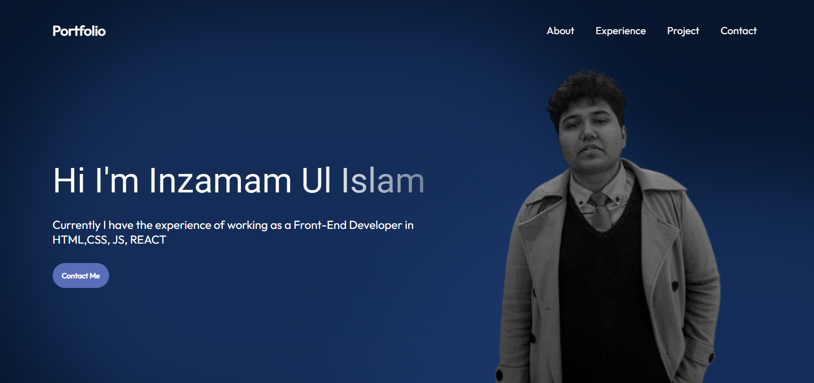

# 🌟 Inzamam Ul Islam - Portfolio Website

Welcome to my personal portfolio website! This project showcases my journey, skills, and selected projects as a Front-End Developer and Software QA enthusiast. Designed with both aesthetics and functionality in mind, it serves as a digital resume and a window into my professional world.

---

## 🔍 About the Project

This portfolio is a reflection of my growth in the field of Front-End Development and Manual Testing. It includes interactive sections like About Me, Skills, Projects, Resume, and Contact. Built with a modern tech stack and responsive design principles, it ensures a smooth experience across devices.

---

## 🚀 Features

- ✅ Responsive Design (Mobile-Friendly)
- 🎨 Modern and Minimalist UI
- 🧪 Projects section with live demo links
- 📄 Downloadable Resume
- 📬 Functional Contact Form (via EmailJS or FormSubmit)
- 🌙 Dark/Light Mode Toggle (optional)
- 🌐 SEO and Performance Optimized

---

## 🛠️ Tech Stack

- **Frontend**: HTML5, CSS3, JavaScript, React.js, Vite
- **Tools**: Git, GitHub, VS Code, Figma
- **Deployment**: Netlify / Vercel / GitHub Pages

---

## 🌐 Live Preview

🔗 [Visit My Live Portfolio](# 🌟 Inzamam Ul Islam - Portfolio Website

Welcome to my personal portfolio website! This project showcases my journey, skills, and selected projects as a Front-End Developer and Software QA enthusiast. Designed with both aesthetics and functionality in mind, it serves as a digital resume and a window into my professional world.

---

## 🔍 About the Project

This portfolio is a reflection of my growth in the field of Front-End Development and Manual Testing. It includes interactive sections like About Me, Skills, Projects, Resume, and Contact. Built with a modern tech stack and responsive design principles, it ensures a smooth experience across devices.

---

## 🚀 Features

- ✅ Responsive Design (Mobile-Friendly)
- 🎨 Modern and Minimalist UI
- 🧪 Projects section with live demo links
- 📄 Downloadable Resume
- 📬 Functional Contact Form (via EmailJS or FormSubmit)
- 🌙 Dark/Light Mode Toggle (optional)
- 🌐 SEO and Performance Optimized

---

## 🛠️ Tech Stack

- **Frontend**: HTML5, CSS3, JavaScript, React.js, Vite
- **Tools**: Git, GitHub, VS Code, Figma
- **Deployment**: Netlify / Vercel / GitHub Pages

---

## 🌐 Live Preview

🔗 [Visit My Live Portfolio](https://your-live-link.netlify.app)

---

## 📸 Screenshots

| Home Page | Projects Section |
|-----------|------------------|
|  | 

> *(Add your actual screenshots inside a `/screenshots` folder in your repo)*

---

## 🧾 Getting Started Locally

To run this project on your local machine:

```bash
git clone https://github.com/your-username/portfolio.git
cd portfolio
npm install
npm run dev
)

---

## 📸 Screenshots

| Home Page | Projects Section |
|-----------|------------------|
|  |  |

> *(Add your actual screenshots inside a `/screenshots` folder in your repo)*

---

## 🧾 Getting Started Locally

To run this project on your local machine:

```bash
git clone https://github.com/your-username/portfolio.git
cd portfolio
npm install
npm run dev
